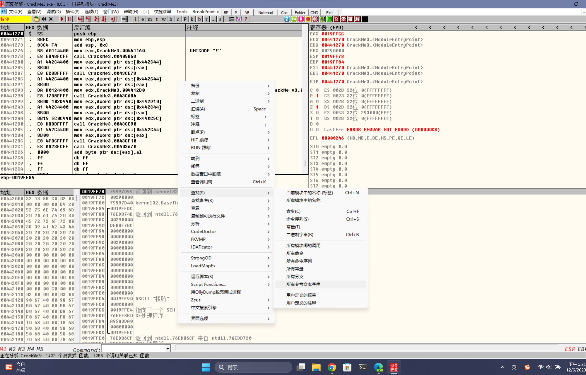

# ollydbg动态调试第二章

这边跟个教学文章的步骤继续实作及做笔记，在前一篇我们针对OD做了一些入门的介绍，但是实际上都还没有真正对OD实际操作; 这篇文章将会直接进行破解软件的实作，主要是为了熟OD的操作，废话不多说。

## 前言：

今天的目的程序是看雪兄《加密与解密》第一版附带光盘中的 crackmes.cjb.net 对映打包中的 CFF Crackme #3，采用用户名/序号保护模式。

原版加了个 UPX 的壳。 刚开始学破解先不涉及壳的问题，我们主要是熟悉用 OllyDBG 来破解的一般方法。 我这里把壳脱掉来分析，附件是脱壳后的档案，直接就可以拿来用。

先说一下一般软件破解的流程： 拿到一个软件先别急着马上用 OllyDBG 调试，先执行一下，有说明文件的最好先看一下说明，熟悉一下软件的使用方法，再看看注册的模式。 如果是序号模式可以先输个假的来试一下，看看有什么反应，也给我们破解留下一些有用的线索。

如果没有输入注册码的地方，要考虑一下是不是读取注册表或 Key 文件（一般称 keyfile，就是编程读取一个文件中的内容来判断是否注册），这些可以用其它工具来辅助分析。

如果这些都不是，原程序只是一个功能不全的试用版，那要注册为正式版本就要自己来写代码完善了。 有点跑题了，呵呵。 获得程序的一些基本信息后，还要用查壳的工具来查一下程序是否加了壳，若没壳的话看看程序是什么编译器编的，如 VC、Delphi、VB 等。

这样的查壳工具有 PEiD ，studyPE等。 有壳的话我们要尽量脱了壳后再来用 OllyDBG 调试，特殊情况下也可带壳调试。

注：壳，意思为将软件做加密保护，在尚未解密（脱壳）的状况下，基本上是无法反汇编回来的; 然而加密也有很多种方式针对不同的加密有会有不同的解密（脱壳），所以需要查壳工具。 注：PEiD，在后面会特别拿出来做简单介绍。

## 破解程序下载：



## PEID：



### 使用PEID查壳：

<figure><figcaption><p>显示使用delphi编写</p></figcaption></figure>

### 开启使用并分析`CrackMe3.exe` <a href="#kai-qi-crackme3exe-shi-yong-bing-fen-xi" id="kai-qi-crackme3exe-shi-yong-bing-fen-xi"></a>

* 开启 CrackMe3.exe，发现已经把用户名和注册码都输好了，省去麻烦
* 点击「Register now ！」 按钮
* 跳出一个对话框「Wrong Serial，try again！」

分析：后面的破解就从这个错误对话框中显示的「Wrong Serial，try again！」 来入手。

<figure><figcaption></figcaption></figure>

<figure><figcaption></figcaption></figure>

### 开启窗口标题： <a href="#kai-qi-shi-chuang-biao-ti" id="kai-qi-shi-chuang-biao-ti"></a>

会有这个步骤是因为我在分析的过程中，发现窗口中都没有标题，于似乎找到如何打开标题，这边就特别提出来说。

* 于窗口中点击右键选择 界面选项 -> 显示标题
* 于其他窗口都做以上相同动作

<figure><figcaption></figcaption></figure>

## 使用OllyDBG分析 <a href="#shi-yong-ollydbg-fen-xi" id="shi-yong-ollydbg-fen-xi"></a>

* 启动`OllyDBG`
* 按下快捷键`F3`
* 选择`CrackkMe3.exe`
* 在入口点地址后面加上注释 （ 良好的注释有助于分析）

> 注：加注解方式可以双击左键，会出现输入窗口。 或是按下键盘快捷键亦可。

* 于反汇编窗口按下右键
* 选择 查找 -> 所有参考文本字串

\


<figure><figcaption></figcaption></figure>

***

会开启一个的窗口文字字串参考位于 CrackMe3:CODE 在此窗口上按下右键 选择查找文字 输入（注意区分大小写），勾选，按下确定Wrong整个范围 会看到跳转到的位置00440F79 mov edx,0044108C ASCII "Wrong Serial,try again!"

<figure><figcaption></figcaption></figure>

<figure><figcaption></figcaption></figure>

* 右键点击该地址
* 选择 反汇编窗口中跟随
* 将回到反汇编窗口并追随并highlight（高亮）

<figure><figcaption></figcaption></figure>

<figure><figcaption></figcaption></figure>

* 此时会发现两个相同参考
* 确认是否还有其他参考
* 在该地址点击右键选择 查找参考 -> `立即数`

<figure><figcaption></figcaption></figure>

* 跳出窗口\
  会发现组共有两个参考位置：\
  第一个为一开始的参考位置。\
  第二个为其他的参考位置\
  （正常情况可能有更多的参考位置）参考位于 `CrackMe3:CODE 到常數 44108C`

<figure><figcaption></figcaption></figure>

### 反汇编窗口内容：

```
// 汇编代码
-----------------------------------------------------------------------
00440F79  |.  BA 8C104400   mov edx,0044108C                         ;  ASCII "Wrong Serial,try again!"
00440F7E  |.  A1 442C4400   mov eax,dword ptr ds:[442C44]
00440F83  |.  8B00          mov eax,dword ptr ds:[eax]
00440F85  |.  E8 DEC0FFFF   call 0043D068
00440F8A  |.  EB 18         jmp short 00440FA4
00440F8C  |>  6A 00         push 0
00440F8E  |.  B9 80104400   mov ecx,00441080                         ;  ASCII "Beggar off!"
00440F93  |.  BA 8C104400   mov edx,0044108C                         ;  ASCII "Wrong Serial,try again!"
00440F98  |.  A1 442C4400   mov eax,dword ptr ds:[442C44]
00440F9D  |.  8B00          mov eax,dword ptr ds:[eax]
00440F9F  |.  E8 C4C0FFFF   call 0043D068
```

* 于反汇编窗口上下卷动看一下
* 这边稍微做个分析

<figure><figcaption></figcaption></figure>

```
// 汇编代码
-----------------------------------------------------------------------

00440F2C       |.  8B45 FC          mov eax,dword ptr ss:[ebp-4]
00440F2F       |.  BA 14104400      mov edx,00441014                         ;  ASCII "Registered User"
00440F34       |.  E8 F32BFCFF      call 00403B2C
00440F39       |.  75 51            jnz short 00440F8C
00440F3B       |.  8D55 FC          lea edx,dword ptr ss:[ebp-4]
00440F3E       |.  8B83 C8020000    mov eax,dword ptr ds:[ebx+2C8]
00440F44       |.  E8 D7FEFDFF      call 00420E20
00440F49       |.  8B45 FC          mov eax,dword ptr ss:[ebp-4]
00440F4C       |.  BA 2C104400      mov edx,0044102C                         ;  ASCII "GFX-754-IER-954"
00440F51       |.  E8 D62BFCFF      call 00403B2C
00440F56       |.  75 1A            jnz short 00440F72
00440F58       |.  6A 00            push 0
00440F5A       |.  B9 3C104400      mov ecx,0044103C                         ;  ASCII "CrackMe cracked successfully"
00440F5F       |.  BA 5C104400      mov edx,0044105C                         ;  ASCII "Congrats! You cracked this CrackMe!"
00440F64       |.  A1 442C4400      mov eax,dword ptr ds:[442C44]
00440F69       |.  8B00             mov eax,dword ptr ds:[eax]
00440F6B       |.  E8 F8C0FFFF      call 0043D068
00440F70       |.  EB 32            jmp short 00440FA4
00440F72       |>  6A 00            push 0
00440F74       |.  B9 80104400      mov ecx,00441080                         ;  ASCII "Beggar off!"
00440F79       |.  BA 8C104400      mov edx,0044108C                         ;  ASCII "Wrong Serial,try again!"
00440F7E       |.  A1 442C4400      mov eax,dword ptr ds:[442C44]
00440F83       |.  8B00             mov eax,dword ptr ds:[eax]
00440F85       |.  E8 DEC0FFFF      call 0043D068
00440F8A       |.  EB 18            jmp short 00440FA4
00440F8C       |>  6A 00            push 0
00440F8E       |.  B9 80104400      mov ecx,00441080                         ;  ASCII "Beggar off!"
00440F93       |.  BA 8C104400      mov edx,0044108C                         ;  ASCII "Wrong Serial,try again!"
00440F98       |.  A1 442C4400      mov eax,dword ptr ds:[442C44]
00440F9D       |.  8B00             mov eax,dword ptr ds:[eax]
00440F9F       |.  E8 C4C0FFFF      call 0043D068

```

### 分段分析 <a href="#fen-duan-fen-xi" id="fen-duan-fen-xi"></a>

（以下在本人对汇编语言不是很会懂的情况下分析，所以以下为不负责任分析，如有错误请鞭小力一点）

* 我标示的为跳出错误讯息的地方红色区块
* 可以看到他上方有个跳转箭头，指向到上方我标示的蓝色区块
* 所以我可以合理怀疑这段call是关键`00440F51 |. E8 D62BFCFF call 00403B2C`
* 也可以怀疑跳转到这边就会去执行跳出错误讯息`00440F39 |. /75 51 jnz short 00440F8C`

<figure><figcaption></figcaption></figure>

* 我标示的为跳出错误讯息的地方红色区块
* 可以看到他上方有个跳转箭头，指向到上方我标示的蓝色区块
* 所以我可以合理怀疑这段call是关键`00440F34 |. E8 F32BFCFF call 00403B2C`
* 也可以怀疑跳转到这边就会去执行跳出错误讯息`00440F56 |. /75 1A jnz short 00440F72`

<figure><figcaption></figcaption></figure>

* 根据结果，我们在后方加入注解`分段分析`

### 开始Debug <a href="#kai-shi-debug" id="kai-shi-debug"></a>

（这边是非常重要的一个环节）

* 在的位置按下设置断点`00440F2C |. 8B45 FC mov eax,dword ptr ss:[ebp-4]F2`

\


<figure><figcaption></figcaption></figure>

* 按下执行程序，会看到CrackMe.exe程序，被执行了。`F9`

<figure><figcaption></figcaption></figure>

* 我们编辑的数据，改为好了。`Unregistered...abcd1234`

<figure><figcaption></figcaption></figure>

* 点击「Register now ！」 按钮
* OllyDBG 跳了出来，暂停在我们下的断点处
* 可以看到信息窗口的内容（应该发现我们刚刚输入的在这边显示）`abcd1234`
* eax=00000008 表示你刚刚输入的内容的长度 （这边是8）

```
堆栈 ss:[0018F948]=01BF4008, (ASCII "abcd1234")
eax=00000008
```

<figure><figcaption></figcaption></figure>

### &#x20;

\


\
